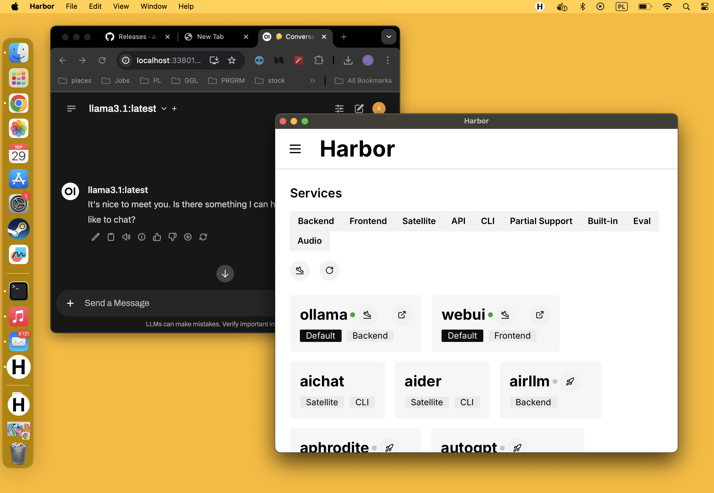

## Installation

> [!NOTE]
> Harbor is still a young project (hence the 0.x.x versioning), installation and some features might not work as expected. Please report any issues you encounter.

- [Requirements](#requirements)
- [Harbor CLI](#harbor-cli)
  - [Unsafe install](#unsafe-install)
  - [Manual install](#manual-install)
- [Harbor App](#harbor-app)
  - [Prerequisites](#prerequisites)
  - [Install Harbor App](#install-harbor-app)
    - [Linux](#linux)
    - [MacOS](#macos)
  - [MacOS Installation Issue](#macos-installation-issue)

### Preparing your system

Harbor is a containerized toolkit that runs on top of Docker, that's what enables it to support such a wide range of services and platforms. The drawback is that you'll need to have Docker installed and configured on your system.

Before proceeding to install harbor itself, you'll need:
- On Windows: [Windows Subsystem for Linux (WSL2)](https://learn.microsoft.com/en-us/windows/wsl/install)
- [git](https://git-scm.com/book/en/v2/Getting-Started-Installing-Git)
- [Docker Engine](https://docs.docker.com/engine/install/)
- [Docker Compose Plugin](https://docs.docker.com/compose/install/) ([v2.23.1](https://docs.docker.com/compose/releases/release-notes/#2231) or newer)
- If you have Nvidia GPU - [Nvidia Container Toolkit](https://docs.nvidia.com/datacenter/cloud-native/container-toolkit/latest/install-guide.html#installation)
- If you have AMD GPU - [ROCm kernel mode driver](https://rocm.docs.amd.com/projects/install-on-linux/en/latest/how-to/docker.html#prerequisites)

Let's go through the installation steps for each of these components.

#### Windows Subsystem for Linux (WSL2)

Harbor currently relies on Bash-compatible shell for the CLI to function, on Windows it means requiring WSL2. Please follow the official guide to [install WSL2](https://learn.microsoft.com/en-us/windows/wsl/install). Harbor was tested with `ubuntu` distribution, but should work with others as well.

#### Git

Harbor currently relies on `git` for updates and version control of the CLI (even when installed via a package manager). Typically, any installation of `git` will work, it just should be available in your shell. On Windows, it should be available in WSL2.

#### Docker Engine


### Requirements

Before installing Harbor's CLI or App, please go through below checklist line-by-line completing every step relevant to your platform and hardware.

- On Windows - [enable WSL2](https://learn.microsoft.com/en-us/windows/wsl/install)
- All Platforms - [install git](https://git-scm.com/book/en/v2/Getting-Started-Installing-Git)
- All Platforms - [install Docker](https://docs.docker.com/engine/install/)
  - On Linux - complete post-install for [`docker` without `sudo`](httpws://docs.docker.com/engine/install/linux-postinstall/)
  - On Windows - [enable Docker in WSL2](https://docs.docker.com/desktop/wsl/#enabling-docker-support-in-wsl-2-distros)
  - With Nvidia GPU - [install NVIDIA Container Toolkit](https://docs.nvidia.com/datacenter/cloud-native/container-toolkit/latest/install-guide.html#installation)
    - Enables GPU pass-through for supported services
    - On Windows - install the Container Toolkit under WSL2 following Linux instructions
- All Platforms - [install Docker Compose plugin](https://docs.docker.com/compose/install/)
  - Harbor requires Docker Compose [2.23.1](https://docs.docker.com/compose/releases/release-notes/#2231) or newer
- All Platforms - Bash-compatible shell 3.2 or newer
  - Should be available on WSL2, MacOS and Linux platforms out of the box
  - Harbor sometimes uses features from newer Bash - please report any issues you encounter

> [!NOTE]
> MacOS: some services do not ship ARM64 images. GPU pass-through is not supported on MacOS.

Once the CLI is installed, you can also use [`harbor doctor`](./3.-Harbor-CLI-Reference#harbor-doctor) command to troubleshoot installation issues.

### Harbor CLI

#### Installation methods

Harbor CLI can be installed in multiple ways that are listed below.

- [Unsafe one-liner](#unsafe-one-liner)
- [Package Managers](#package-managers)
  - On Windows - ensure to install within WSL2
- [Manual install](#manual-install)

#### Package Managers

Please note that installation via package managers is experimental and might differ from the "native" installation via the script or manual method.

**NPM**

```bash
# Note the "global" flag
npm install -g @avcodes/harbor
```

**PyPI**

```bash
# Use pipx as harbor is a CLI tool
pipx install llm-harbor
```

#### Unsafe one-liner

- Runs the install script directly from the internet (make sure you understand the risks)
- Will clone the Harbor repository to your home directory
- Will write to your shell profile to add bin folder to the path

```bash
curl https://av.codes/get-harbor.sh | bash
```

#### Manual install

Same as above, just done by you.

```bash
git clone https://github.com/av/harbor.git && cd harbor

# [Optional] make Harbor CLI available globally
# Otherwise, call this .sh file instead of `harbor`
./harbor.sh ln
```

#### Verify

```bash
# Check the installation
harbor --version
harbor --help

# Run doctor script to
# check if all requirements are met
harbor doctor

# [Optional] Start default services
# Initial download of the docker images might take a while
# If you have container toolkit installed, GPU will
# be automatically used for supported services.
harbor up

# [Optional] open Webui in the browser
harbor open
```

> [!NOTE]
> First launch of the [Open WebUI](./2.1.1-Frontend:-Open-WebUI) will require you to create a local admin account. Harbor keeps such auth requirements on by default because it also supports [exposing your local stack to the internet](./3.-Harbor-CLI-Reference#harbor-tunnels).

#### Next Steps

- [Harbor User Guide](./1.-Harbor-User-Guide)
- [Harbor CLI Reference](./3.-Harbor-CLI-Reference)
- [Harbor Services](./2.-Services)

### Harbor App

> [!NOTE]
> Harbor App is even younger than the CLI and might have more issues. Please report any issues you encounter.

#### Prerequisites

> [!NOTE]
> As for the moment, Harbor App is avaialble but not tested on Windows. Contributions are welcome! You can still use the Harbor CLI with WSL2.

- [Harbor CLI v0.2.0 or newer](#harbor-cli), installed and available globally

#### Install Harbor App

#### Linux

Depending on your distribution, download the latest `.deb` or `.AppImage` package from the [latest release](https://github.com/av/harbor/releases/latest) and install it.

#### MacOS

I don't have an Apple developer account and consequently can't sign apps. As a result - to run the app, you'dd need to bypass the quarantine after downloading it.

- Download the `Harbor_aarch64.app.tar.gz` from the [releases page](https://github.com/av/harbor/releases)
- Run the `.tar.gz` file - it'll be extracted in-place, you'll see the `Harbor.app` file in the same directory
- Open the terminal in the same directory and run the following command

```bash
sudo xattr -d com.apple.quarantine ./Harbor.app
```

You'll be prompted for your system password. After that, you can run the app from the file. Optionally, you might also copy it to your "Applications" folder for easier access.

After these actions, you should have the Harbor App running on your system.



#### Windows

> [!NOTE] Harbor App requires Harbor CLI installed and configured to function

Download `.msi` or `setup.exe` and run the installed.

#### Next Steps

- [Harbor App](./1.1-Harbor-App)
- [Harbor Services](./2.-Services)
